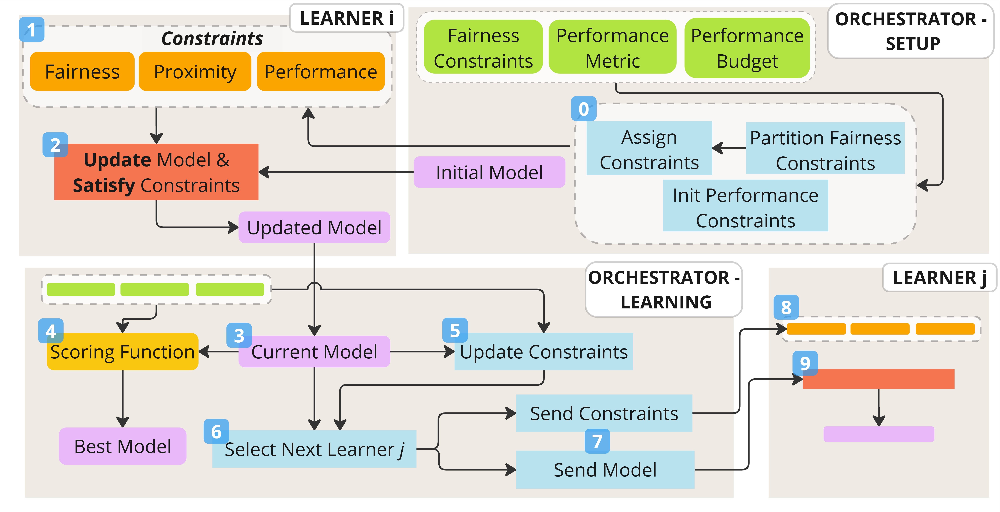

# FairLAB (Fairness via Lagrangian Augmented with a performance Budget)
<p align="center">

</p>

`FairLAB` (Fairness via Lagrangian Augmented with a performance Budget) is a a method for training *fair* and *high-performing* neural networks under both group and intersectional fairness constraints, exploiting Augmented Lagrangian Method. With its tunable *performance budget*, which provides explicit control to the trade-off between fairness and performance, `FairLAB` is flexible and adaptive. In addition, by employing a divide-et-impera strategy for decomposing the fairness problem, `FairLAB` is scalable, particularly effective in intersectional fairness settings, where multiple sensitive attributes interact.

---

## **Installation**

We recommend setting up a new Conda environment with **Python >= 3.9**.

### **1. Create a Conda environment**
```bash
conda create -n "fairlab" python==3.9
```

### **2. Activate the environment**
```bash
conda activate fairlab
```

### **3. Clone the repository**
```bash
git clone https://anonymous.4open.science/r/ECMLPKDD2025-016B/
```

### **4. Navigate to the project directory**
```bash
cd ECMLPKDD2025-016B
```

### **5. Install dependencies**
```bash
pip install -r requirements.txt
```

---

## **Project Structure**
The project follows this structure:

```bash
.
├── LICENSE
├── README.md
├── data
│   ├── Folktables
│   ├── Compas
│   └── MEP
├── requirements.txt
└── src
    ├── architectures
    ├── callbacks
    ├── dataloaders
    ├── loggers
    ├── main.py
    ├── metrics
    ├── runs
    ├── surrogates
    └── wrappers
        ├── orchestrator.py
        └── learner.py
        
```

- **`data/`** → Contains the datasets used in experiments.
- **`src/`** → Contains the core implementation of FairLab.

---
## **Experimental Setting**
In this section, we provide details about the experimental setting.

### **Sensitive Attributes**
In the experiments we consider the following sensitive attributes:
- `FolkTables`: 
  - `Job` : {Public Employee,Self Employed,Private Employee}
  - `Race` : {White, Black,Asian,Other,Indigenous}
  - `Marital Status` : {Married,Never Married,Divorced,Other}
- `Compas`: 
  - `Gender` : {Male, Female}
  - `Race` : {African-American,Caucasian,Other}
  - `Age` : {Less than 25, 25 - 45, Greater than 45}
- `MEPS`: 
  - `Gender` : {Male, Female}
  - `Race` : {Hispanic,Black,White,Other}
  - `Marital Status` : {Married,Never Married,Other}

### **Neural Networks**

Across all datasets, we train a feedforward neural network with two hidden layers containing $300$ and $100$ neurons, respectively, and ReLU activations. A Dropout layer with a rate of $0.2$ is applied after the last hidden layer for regularization, while the output layer uses the Softmax function.

### **Hyper-parameters**

Regarding training, we train the neural network for a maximum of $100$ iterations at the orchestrator level and up to $30$ epochs per learner. Early stopping is applied with a patience of $5$ epochs at both levels, based on the scoring functions *S* and *LS*, respectively. At the learner level, we employ the Adam optimizer with a learning rate of $1e^{-4}$, a weight decay factor of $1e^{-4}$, and a batch size of $128$. The loss function is the Cross-Entropy, and the fairness threshold is set to $\tau = 0.2$.

---

## **Usage**

To run an experiment with `FairLab`:

### **1. Navigate to the `src` directory**
```bash
cd src
```

### **2. Execute `main.py` with options**
```bash
python main.py --options
```

### **Available Options**
```bash
Options:
  -r, --run TEXT                  Name of the run to execute
  -p, --project_name TEXT         Name of the WandB project
  -ml, --metrics_list TEXT        List of fairness metrics
  -gl, --groups_list TEXT         List of sensitive groups
  -tl, --threshold_list FLOAT     Threshold values for fairness constraints
  -d, --delta FLOAT               Value of the proximity threshold (default = 0.02)
  -rs --rho_step FLOAT            Value of performance step parameter (default = 0.01)
  -nt --nu_tol FLOAT              Value of the tolerance threshold (default = 0.05)
  -pb --performance_budget FLOAT  Value of the performance budget (default = 0.05)
```

#### **Predefined Runs (`runs` folder)**
- **`folk_fairlab`** → Uses the **FolkTables** dataset.
- **`compas_fairlab`** → Uses the **Compas** dataset.
- **`meps_fairlab`** → Uses the **MEPS** dataset.

The code supports the following **fairness metrics**:
- `demographic_parity`
- `equal_opportunity`
- `predictive_equality`
- `equalized_odds`

---
## **Available Groups**
In this work, we consider the following groups, corresponding to the single or intersectional attributes used in our experiments.

- For `FolkTables`: {`Job`,`Race`,`Marital`,`JobRace`,`JobMarital`,`RaceMarital`,`JobRaceMarital`}
- For `Compas`: {`Gender`,`Race`,`Age`,`GenderRace`,`GenderAge`,`RaceAge`,`GenderRaceAge`}
- For `MEPS`: {`Gender`,`Race`,`Marital`,`GenderRace`,`GenderMarital`,`RaceMarital`,`GenderRaceMarital`}

---
## **Logging**
The code uses **Weights & Biases (WandB)** for experiment tracking. 
To use it:
1. Create a free account at [WandB](https://wandb.ai/site/).
2. Follow the login instructions after executing the code.

We plan to allow users to choose other logging systems in the future.

---

## **Examples**

### **1. One Fairness Constraint**
Create an experiment enforcing **Demographic Parity (DP ≤ 0.20) on GenderRace** using the **Compas** dataset, with a performance budget of 0.05 and a delta of 0.02.
```bash
python main.py -r compas_fairlab -ml demographic_parity -tl 0.20 -gl GenderRace -p Compas_GenderRace -pb 0.05 -d 0.02
```

### **2. Mixed Fairness Metrics**
Create an experiment enforcing **DP ≤ 0.20 on GenderRace** and **DP ≤ 0.20 on  on GenderAge**, using the **Compas** dataset.

```bash
python main.py -r compas_fairlab -ml demographic_parity -tl 0.20 -gl GenderRace -ml demographic_parity -tl 0.20 -gl GenderAge -p Compas_Mixed -pb 0.05 -d 0.02
```

---

## **License**
This project is licensed under the **Apache 2.0 License**. See the [LICENSE](LICENSE) file for details.

---

## **Contact**
For any questions or suggestions, feel free to reach out:

